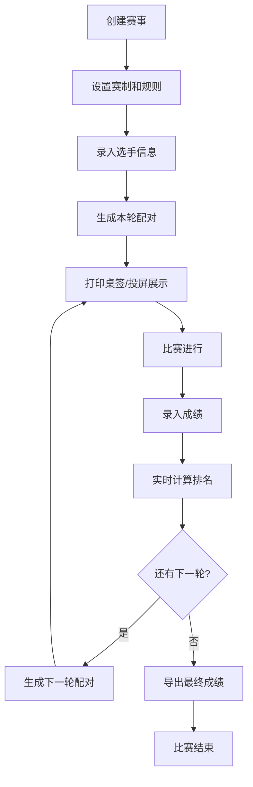

## 1. 产品概述

桌游比赛编排系统是一款纯前端Web应用，专为桌游店和社群设计，用于组织瑞士轮、淘汰赛等小型比赛。无需后端服务器，打开浏览器即可完成现场比赛的全流程编排与管理。

- 核心价值：简化线下桌游比赛组织流程，降低编排难度，提升赛事体验
- 目标用户：桌游店店主、社群组织者、赛事裁判

## 2. 核心功能

### 2.1 用户角色
| 角色 | 登录方式 | 核心权限 |
|------|----------|----------|
| 组织者/裁判 | 无需登录，本地使用 | 全部功能：创建赛事、管理选手、编排配对、录入成绩、导出数据 |

### 2.2 功能模块
1. **赛事设置**：创建赛事、选择赛制（瑞士轮/淘汰赛）、设置轮数、配置比赛规则
2. **选手报名**：批量录入选手、导入历史选手、标记迟到/退赛、选手信息管理
3. **分组配对**：自动配对（避免重复交手）、手动调整桌号、生成对阵表
4. **成绩录入**：录入胜负平、小分计算、弃权处理、批量录入
5. **排名榜**：实时排名计算、多维度排序、个人赛程查询
6. **投屏看板**：大屏展示对阵信息、实时比分、轮次状态
7. **数据导入导出**：导出成绩表、打印桌签、保存本地草稿、导入选手库

### 2.3 页面详情
| 页面名称 | 模块名称 | 功能描述 |
|----------|----------|----------|
| 赛事管理 | 赛事列表 | 查看历史赛事、新建赛事、编辑赛事、删除赛事 |
| 赛事设置 | 基础配置 | 赛事名称、赛制选择、轮数设置、计分规则配置 |
| 选手管理 | 选手列表 | 选手增删改、批量导入、状态标记（正常/迟到/退赛） |
| 分组配对 | 对阵管理 | 自动配对算法、手动调整桌号、避免重复交手校验 |
| 成绩录入 | 比分录入 | 单场/批量录入比分、弃权处理、小分记录 |
| 排名榜 | 排名展示 | 实时排名、积分计算、胜负关系、小分排名 |
| 投屏看板 | 大屏展示 | 对阵信息大屏、实时比分轮播、醒目视觉效果 |
| 数据中心 | 导入导出 | 成绩表导出(CSV/Excel)、桌签打印、草稿保存/恢复 |

## 3. 核心流程

### 3.1 比赛组织主流程

### 3.2 瑞士轮配对流程
1. 根据当前积分对选手排序
2. 高分选手优先配对
3. 检查避免重复交手
4. 如有冲突进行调整
5. 生成最终对阵表

## 4. 用户界面设计

### 4.1 设计风格
- **主色调**：深蓝(#1e3a5f) + 金色(#d4af37)，体现专业竞技感
- **辅助色**：翠绿(#10b981)表示胜利/进行中，橙色(#f59e0b)表示警告/待定，红色(#ef4444)表示失败/弃权
- **中性色**：深灰(#1f2937)背景，浅灰(#f3f4f6)卡片，白色文字
- **按钮风格**：圆角8px，悬停有轻微放大和阴影变化，点击有按压反馈
- **字体**：标题使用 Noto Sans SC Bold，正文使用 Noto Sans SC Regular，数字使用等宽字体增强可读性
- **布局风格**：卡片式布局，顶部导航 + 侧边标签页切换，内容区域留白充足
- **图标风格**：使用 lucide-react 线性图标，保持简洁统一

### 4.2 页面设计概览
| 页面名称 | 模块名称 | UI元素 |
|----------|----------|--------|
| 赛事设置 | 表单区域 | 卡片容器、表单控件、下拉选择、数字输入、开关切换 |
| 选手管理 | 列表区域 | 数据表格、搜索框、批量操作栏、状态标签、导入按钮 |
| 分组配对 | 对阵卡片 | 对战卡片网格、桌号标签、选手信息、拖动调整手柄 |
| 成绩录入 | 比分面板 | 对阵列表、比分输入框、胜负选择、快捷按钮 |
| 排名榜 | 排名表格 | 排行榜单、名次奖牌、积分条、排序切换 |
| 投屏看板 | 大屏展示 | 大字号对阵信息、滚动动画、醒目背景、倒计时 |
| 数据中心 | 操作面板 | 导出按钮组、文件上传区、草稿列表、预览卡片 |

### 4.3 响应式
- **桌面优先**：针对1920×1080及以上分辨率优化，适配投屏展示
- **平板适配**：1024px断点，调整网格布局列数
- **手机适配**：768px断点，导航转为底部Tab，表格转为卡片列表
- **触控优化**：按钮最小44×44px，点击区域充足

### 4.4 动效设计
- 页面切换：淡入淡出 + 轻微位移
- 卡片悬停：阴影加深、轻微上移
- 排名变化：数字滚动动画
- 投屏看板：对阵信息轮播切换、比分更新闪烁效果
- 加载状态：骨架屏脉冲动画
