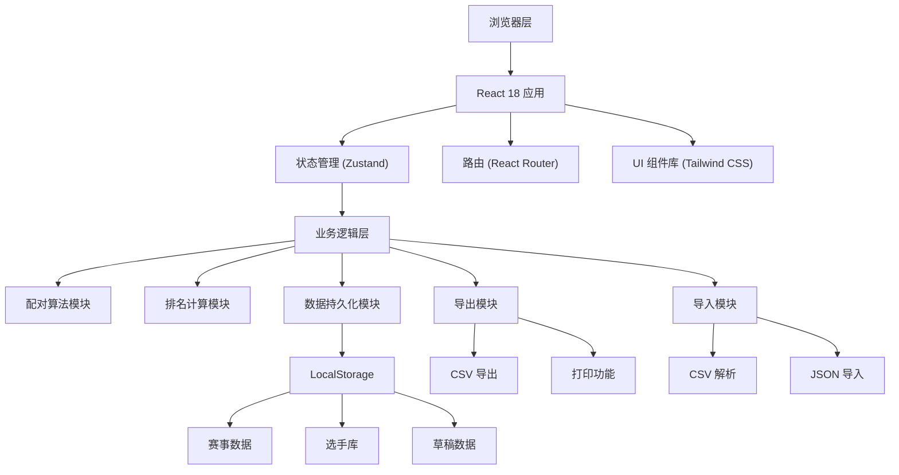
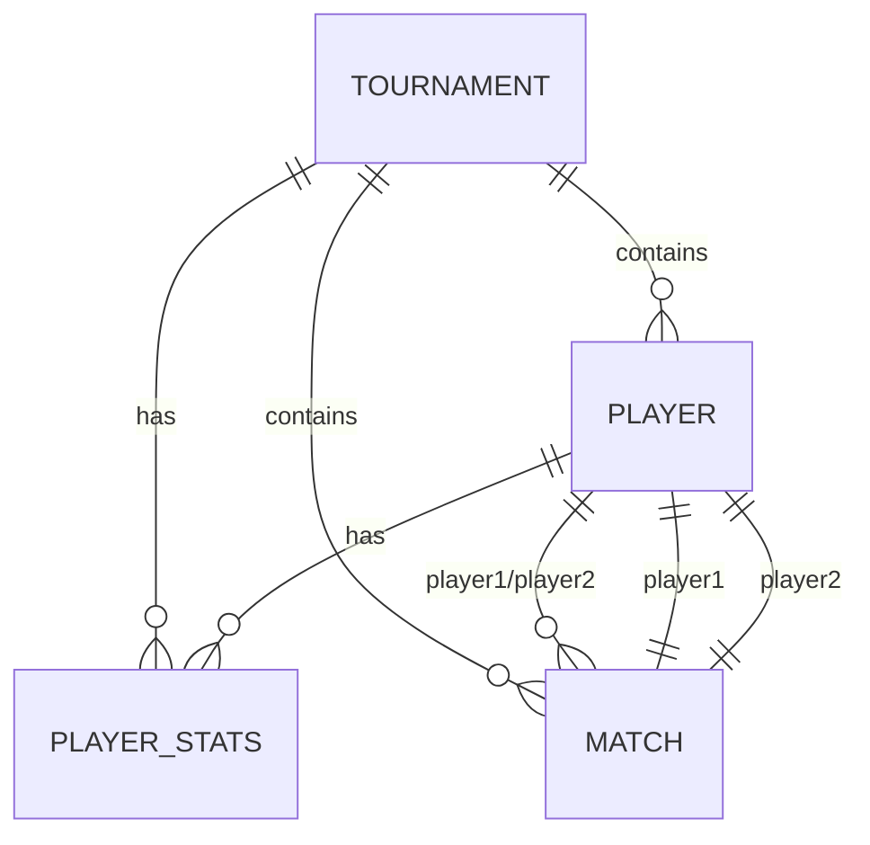

## 1. 架构设计



## 2. 技术描述

- **前端框架**：React@18 + TypeScript
- **构建工具**：Vite@5
- **路由管理**：react-router-dom@6
- **状态管理**：zustand@4
- **样式方案**：tailwindcss@3
- **图标库**：lucide-react
- **数据持久化**：localStorage（纯前端，无后端）
- **初始化模板**：react-ts（纯前端项目）

## 3. 路由定义

| 路由 | 页面 | 功能描述 |
|------|------|----------|
| / | 赛事列表 | 展示所有赛事，新建/编辑/删除赛事入口 |
| /tournament/:id/settings | 赛事设置 | 配置赛事基本信息、赛制、规则 |
| /tournament/:id/players | 选手管理 | 选手录入、导入、状态管理 |
| /tournament/:id/pairing | 分组配对 | 自动配对、手动调整、生成对阵 |
| /tournament/:id/results | 成绩录入 | 录入比分、处理弃权 |
| /tournament/:id/ranking | 排名榜 | 实时排名、个人赛程查询 |
| /tournament/:id/display | 投屏看板 | 大屏展示对阵信息 |
| /tournament/:id/data | 数据中心 | 导入导出、草稿管理 |

## 4. 数据模型

### 4.1 核心数据类型定义

```typescript
// 赛事状态
type TournamentStatus = 'draft' | 'registration' | 'in_progress' | 'completed';

// 赛制类型
type TournamentFormat = 'swiss' | 'single_elimination' | 'double_elimination' | 'round_robin';

// 选手状态
type PlayerStatus = 'active' | 'late' | 'dropped' | 'bye';

// 比赛结果
type MatchResult = 'win' | 'loss' | 'draw' | 'bye' | 'forfeit' | null;

// 赛事信息
interface Tournament {
  id: string;
  name: string;
  format: TournamentFormat;
  totalRounds: number;
  currentRound: number;
  status: TournamentStatus;
  createdAt: number;
  updatedAt: number;
  scoring: {
    winPoints: number;
    drawPoints: number;
    lossPoints: number;
    byePoints: number;
  };
  settings: {
    avoidRepeatMatches: boolean;
    autoBye: boolean;
    showTiebreakers: boolean;
  };
}

// 选手
interface Player {
  id: string;
  name: string;
  seed?: number;
  status: PlayerStatus;
  tournamentId: string;
  meta?: Record<string, any>;
}

// 选手成绩统计
interface PlayerStats {
  playerId: string;
  tournamentId: string;
  points: number;
  wins: number;
  losses: number;
  draws: number;
  byes: number;
  gameWinCount: number;
  gameLossCount: number;
  opponents: string[];
  tiebreakers: {
    opponentWinRate: number;
    gameWinRate: number;
    cumulative: number;
  };
}

// 对阵/比赛
interface Match {
  id: string;
  tournamentId: string;
  round: number;
  tableNumber: number;
  player1Id: string | null;
  player2Id: string | null;
  player1Result: MatchResult;
  player2Result: MatchResult;
  player1Games: number;
  player2Games: number;
  notes?: string;
  completed: boolean;
}

// 草稿
interface Draft {
  id: string;
  name: string;
  type: 'tournament' | 'players';
  data: any;
  createdAt: number;
  updatedAt: number;
}
```

### 4.2 数据关系图



## 5. 核心算法模块

### 5.1 瑞士轮配对算法
- 按积分从高到低排序选手
- 优先配对积分相邻的选手
- 检查并避免重复交手
- 处理轮空（Bye）分配
- 如遇死锁进行回溯调整

### 5.2 排名计算算法
- 主要排名依据：总积分
- 破同分规则（Tiebreakers）：
  1. 对手胜率（Opponent Win Rate）
  2. 游戏胜率（Game Win Rate）
  3. 累计积分（Cumulative）
- 实时计算，成绩更新后立即重算

### 5.3 淘汰赛对阵生成
- 根据选手数量确定轮次
- 种子选手对位安排
- 自动生成晋级路径

## 6. 项目结构

```
src/
├── components/          # 通用组件
│   ├── layout/         # 布局组件
│   ├── ui/             # 基础UI组件
│   └── features/       # 业务组件
├── pages/              # 页面组件
│   ├── TournamentList.tsx
│   ├── TournamentSettings.tsx
│   ├── PlayerManagement.tsx
│   ├── Pairing.tsx
│   ├── Results.tsx
│   ├── Ranking.tsx
│   ├── DisplayBoard.tsx
│   └── DataCenter.tsx
├── store/              # Zustand状态管理
│   ├── useTournamentStore.ts
│   ├── usePlayerStore.ts
│   └── useMatchStore.ts
├── utils/              # 工具函数
│   ├── pairing.ts      # 配对算法
│   ├── ranking.ts      # 排名计算
│   ├── export.ts       # 导出功能
│   ├── import.ts       # 导入功能
│   └── storage.ts      # 本地存储
├── types/              # TypeScript类型定义
│   └── index.ts
├── hooks/              # 自定义Hooks
│   ├── useTournament.ts
│   └── usePrint.ts
├── App.tsx
├── main.tsx
└── index.css
```
